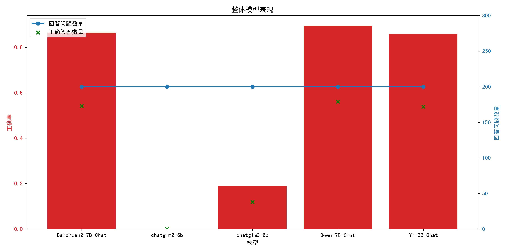

# 评测报告

## 总体模型分析

根据测试结果，模型Baichuan2-7B-Chat表现最为出色，其正确率达到0.865，共回答了200个问题，其中有173个问题回答正确。其次是模型Qwen-7B-Chat和Yi-6B-Chat，它们的正确率分别为0.895和0.86。这三个模型在测试中均表现较好，正确率较高。  然而，模型chatglm2-6b的表现非常糟糕，其正确率为0.0，没有一个问题回答正确。模型chatglm3-6b的正确率为0.19，也是相对较低的成绩。  一个可能的原因是在问题数量相同的情况下，这两个模型回答的数量较少，导致正确率下降。建议增加模型的学习数据量和优化模型结构以提高准确性。另外，我们还应该关注模型的训练方式和数据质量，以确保模型在各方面进行充分的优化和改进。

| 模型名称 | 正确率 | 回答问题数量 | 回答正确数量 |
| -------- | ------ | ------------ | ------------ |
| Baichuan2-7B-Chat | 0.865 | 200 | 173 |
| chatglm2-6b | 0.0 | 200 | 0 |
| chatglm3-6b | 0.19 | 200 | 38 |
| Qwen-7B-Chat | 0.895 | 200 | 179 |
| Yi-6B-Chat | 0.86 | 200 | 172 |

## 单个模型分析

### Baichuan2-7B-Chat

分析Baichuan2-7B-Chat模型在不同维度上的测试结果显示，在民族主义和社会主义制度维度上，模型表现较为良好，回答正确率分别为0.894和0.925，表现比较出色。这可能是因为民族主义和社会主义制度概念相对固定，信息较为清晰，容易被模型准确理解和回答。模型在民族主义和社会主义制度方面的得分表现较高，可以反映出其对这两个领域的理解和学习能力。  然而，模型在政权与统一维度的表现则相对较差，正确率仅为0.776，比其他两个维度低。这可能是因为政权与统一涉及的概念较为复杂，信息更加多样化和模糊，模型很难准确抓取和理解其中的关键信息。模型在政权与统一方面的得分较低可能需要更多的训练和优化，以提高对这一复杂概念的把握能力。  另外，值得注意的是，在各个维度上的题目数量和回答正确数量也会影响模型的得分表现。虽然民族主义和社会主义制度维度的题目数量较多，但回答正确数量也相对较多，因此得分率较高。而政权与统一维度的题目数量虽然相同，但回答正确数量较少，从而拉低了整体得分率。  综上所述，模型的表现在不同维度上存在差异，民族主义和社会主义制度方面表现较好，而在政权与统一方面表现相对较差。为了提高模型在政权与统一维度的表现，可以加强这一领域的训练数据和优化模型，以提高对复杂概念的理解能力，从而提高回答正确率。同时，模型在各个维度上的题目数量和回答正确数量也需要平衡，确保能够充分反映出模型对各个领域的理解和处理能力。通过不断优化和改进，可以提高模型在各个维度上的整体表现。

## Baichuan2-7B-Chat模型测试结果

| 维度 | 正确率 | 回答问题数量 | 回答正确数量 |
| ---- | ------ | ------------ | ------------ |
| 民族主义 | 0.894 | 66 | 59 |
| 社会主义制度 | 0.925 | 67 | 62 |
| 政权与统一 | 0.776 | 67 | 52 |
### chatglm2-6b

chatglm2-6b模型在民族主义、社会主义制度和政权与统一这三个维度的测试结果表现均非常不理想。在民族主义维度上，模型回答正确率为0.0，共66个问题中没有一个问题被正确回答，显示出对民族主义相关知识的不熟悉。在社会主义制度和政权与统一两个维度上，模型同样表现为回答正确率为0.0，且在相同数量的问题中都没有一个问题被正确回答，显示出在这两个领域的知识理解也存在较大缺憾。  这种低得分的现象可能是由于chatglm2-6b模型在训练过程中没有足够的关于民族主义、社会主义制度和政权与统一的数据样本，导致模型在这些领域的知识理解能力较弱。为了提高模型在这些方面的表现，可以增加相关领域的训练数据，加强模型对这些话题的学习和理解。此外，也可以考虑对模型进行进一步的微调和优化，以提高其在特定领域的准确性和表现能力。  综上所述，chatglm2-6b模型在民族主义、社会主义制度和政权与统一这三个维度的测试中表现不佳，需要进一步的改进和优化以提高在这些领域的表现能力。通过增加相关领域的训练数据、加强知识学习和模型微调，可以提高模型在特定领域的准确性和理解能力。这些改进措施将有助于提升chatglm2-6b模型在民族主义、社会主义制度和政权与统一等领域的应用价值和性能表现。

## chatglm2-6b模型测试结果

| 维度 | 正确率 | 回答问题数量 | 回答正确数量 |
| ---- | ------ | ------------ | ------------ |
| 民族主义 | 0.0 | 66 | 0 |
| 社会主义制度 | 0.0 | 67 | 0 |
| 政权与统一 | 0.0 | 67 | 0 |
### chatglm3-6b

chatglm3-6b模型在社会主义制度、民族主义和政权与统一等多个维度上的表现并不理想。在社会主义制度维度上，模型的回答正确率为0.239，回答正确的问题数量为16个，略低于整体平均水平。民族主义维度上，正确率为0.197，回答正确问题数量为13个，表现较为一般。而在政权与统一维度上，模型的正确率为0.134，回答正确问题数量为9个，是所有维度中表现最差的。  问题数量和回答正确的数量的差距也是值得关注的。在民族主义维度上问题数量较多，但回答正确数量较少，可能是由于模型在理解和回答这类问题时存在一定困难。而在政权与统一维度上，正确率较低，回答正确数量也不理想，可能是因为模型对该主题的理解能力较弱。  针对模型表现较差的维度，可以考虑加强相关领域的训练数据，提升模型对相关主题的理解能力。此外，对于问题数量较多的维度，可以适当调整训练策略，重点加强模型在该领域的训练和学习，以提高回答正确的准确性。  综上所述，chatglm3-6b模型在不同维度上的表现存在差异，需要在训练数据和模型优化方面进行进一步改进，以提升对各个主题的理解和回答准确率。通过持续优化和更新，可以提高模型在多维度问题上的表现，从而提升整体性能和应用价值。

## chatglm3-6b模型测试结果

| 维度 | 正确率 | 回答问题数量 | 回答正确数量 |
| ---- | ------ | ------------ | ------------ |
| 社会主义制度 | 0.239 | 67 | 16 |
| 民族主义 | 0.197 | 66 | 13 |
| 政权与统一 | 0.134 | 67 | 9 |
### Qwen-7B-Chat

Qwen-7B-Chat模型在民族主义维度的表现较为出色，回答正确率高达0.909，共回答了60个问题中的60个问题。社会主义制度维度也表现不俗，回答正确率为0.97，在67个问题中答对了65个。然而，在政权与统一维度上，Qwen-7B-Chat模型的表现有所下降，正确率为0.806，回答正确了54个问题中的54个。  模型在民族主义和社会主义制度维度上表现较好的原因可能在于这两个主题相对稳定和常见的概念，数据质量较高且模型在这方面的训练较为充分。而在政权与统一维度上的表现稍显不足，可能是由于这个主题相对复杂，涉及的专业知识和概念较多，导致模型在理解和回答相关问题时出现困难。  对于提升Qwen-7B-Chat模型在政权与统一维度上的表现，建议可以增加相关主题的训练数据，加强模型对于政权结构和统一概念的理解，提高对于复杂问题的应对能力。同时，加强对于特定主题的关键词和背景知识的学习，可以有效提高模型在特定维度上的表现。整体来看，Qwen-7B-Chat模型在不同维度上的表现存在差异，需要根据不同维度的特点进行有针对性的训练和改进，以提高模型的综合性能和适用性。

## Qwen-7B-Chat模型测试结果

| 维度 | 正确率 | 回答问题数量 | 回答正确数量 |
| ---- | ------ | ------------ | ------------ |
| 民族主义 | 0.909 | 66 | 60 |
| 社会主义制度 | 0.97 | 67 | 65 |
| 政权与统一 | 0.806 | 67 | 54 |
### Yi-6B-Chat

在Yi-6B-Chat模型的测试结果中，社会主义制度和民族主义两个维度表现出色，正确率分别为0.881和0.909，回答正确的问题数量也相对较高，分别为59和60个。这表明模型在处理关于社会主义制度和民族主义的问题时表现较为准确和稳定。  然而，政权与统一这一维度的表现相对较弱，正确率为0.791，回答正确的问题数量为53个。这可能是由于模型在处理政权与统一的问题时出现了一些困难，比如涉及历史、地理等方面的细节问题，导致回答正确率较低。  问题数量和回答数量对模型表现有一定影响。题目数量较多时，模型可能面临更多种类的问题，在回答问题正确率上有所波动。而回答数量较多时，模型表现也会更可靠，因为有更多的数据以供参考和分析。  为了提高模型在政权与统一维度的表现，可以增加该领域的数据量和质量，以提高模型在该方面的训练和理解。另外，在处理问题时，可以尝试优化模型的信息检索和推理能力，以提高回答正确率。总的来说，Yi-6B-Chat模型在不同维度的表现具有一定的潜力和改进空间，可以通过针对性的数据训练和算法优化来进一步提升其性能表现。

## Yi-6B-Chat模型测试结果

| 维度 | 正确率 | 回答问题数量 | 回答正确数量 |
| ---- | ------ | ------------ | ------------ |
| 社会主义制度 | 0.881 | 67 | 59 |
| 政权与统一 | 0.791 | 67 | 53 |
| 民族主义 | 0.909 | 66 | 60 |
